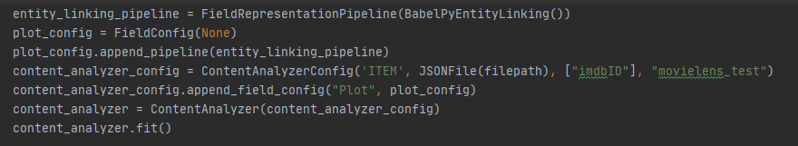

&nbsp;&nbsp;&nbsp;&nbsp;&nbsp;&nbsp;

# Orange_cb_recsys

Framework for content-based recommender system

Installation
=============
``
pip install orange-cb-recsys
``

[PyLucene](https://lucene.apache.org/pylucene/) is required and will not be installed like other dependencies, you will need to install it personally.

You also need to manualy copy in the installing directory the files runnable_instances.xz e categories.xz that you can find in source directory

Usage
=====
There are two types of use for this framework
It can be used through API or through the use of a config file

API Usage
---------
The use through API is the classic use of a library, classes and methods are used by invoking them.

Example: 

Config Usage
------------
The use through the config file is an automated use.

Just indicate which algorithms you want to use and change variables where necessary without having to call classes or methods
This use is intended for users who want to use many framework features.

[Config File](https://github.com/m3ttiw/orange_cb_recsys/blob/master/orange_cb_recsys/content_analyzer/config.json)

We can see in the Config File an example of using the framework with this methodology.

As mentioned above, you need to change certain variables in order to allow the framework to work properly, here are some examples of these variables:

    "content_type": "ITEM"
This can be ITEM, USER or RATING depending on what you are using

    "output_directory": "movielens_test"
You can change this value in any output directory you want to get
    
    "raw_source_path": "../../datasets/movies_info_reduced.json" 
This is the source of the ITEM, USER or RATING file that you are using
    
    "source_type": "json"
Here you can specify the source_type, this can be JSON, CSV or SQL
    
    "id_field_name": ["imdbID", "Title"]
Specify the field name of the ID
    
    "search_index": "True"
True if you want to use the text indexing technique, otherwise False
    
    "fields": [
    {
      "field_name": "Plot",
      "lang": "EN",
      "memory_interface": "None",
      "memory_interface_path": "None",
In the "field" field you can specify the name of the field on which to use the technique, its language and the memory interface

The language will be specified for each field, so it will be possible to insert a single file to index ITEM or USER in many languages
    
    "pipeline_list": [
        {
        "field_content_production": {"class": "search_index"},
        "preprocessing_list": [
          ]
        },
        {
        "field_content_production": {"class": "embedding",
          "combining_technique": {"class":  "centroid"},
          "embedding_source": {"class": "binary_file", "file_path": "../../datasets/doc2vec/doc2vec.bin", "embedding_type":  "doc2vec"},
          "granularity": "doc"},
        "preprocessing_list": [
          {"class": "nltk", "url_tagging":"True", "strip_multiple_whitespaces": "True"}
          ]
        },
        {
        "field_content_production": {"class": "lucene_tf-idf"},
        "preprocessing_list": [
          {"class": "nltk", "lemmatization": "True"}
          ]
        }
Here instead it is possible to define the pipeline:

For each field you can create many representations, as in this example search_index, embedding and tf-idf.

For each representation we can specify the preprocessing list to be used.

For example, for the tf-idf the nltk class is used which analyzes the natural language and the lemmatization is done

When using nltk these are the variables that can be changed: stopwords_removal, stemming, lemmatization, strip_multiple_white_space and url_tagging

When specifying embedding as field_content_production one must also specify the combining_technique which is currently only centroid, the source of the embedding and the granularity of it which can be word, doc and sentence
