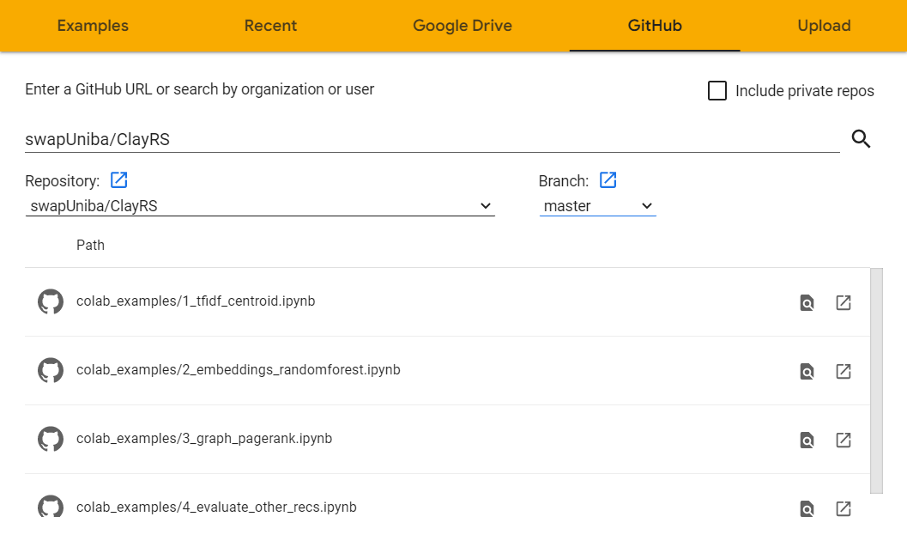

# Colab examples

The GitHub repository hosts some IPython notebooks to get you start and running with the framework!

To use them you could use [Google colab](https://colab.research.google.com/?hl=it):

* Go to Colab and open `File > Open notebook`
<figure markdown>
  { width="600" }
</figure>

* Then go to `GitHub` section, write ***swapUniba/ClayRS*** in the first text box and choose the example you want 
to run!
<figure markdown>
  { width="600" }
</figure>

## Available examples

All the following use the ***Movielens 100k*** dataset

* `1_tfidf_centroid.ipynb`: the easiest example, a good starting point for newcomers of the framework.
It guides you in how to represent via *TfIdf* technique a field of the *raw source*, how to instantiate a 
`CentroidVector` algorithm and how to evaluate recommendations generated with several state-of-the-art metrics;

* `2_embeddings_randomforest.ipynb`: a slightly more complex example, where *several fields* are represented
with *several techniques*, including ***embedding techniques***. For the recommendation phase a 
`Random Forest` classifier is used;

* `3_graph_pagerank.ipynb`: it will guide you on how to perform *graph based recommendation* via `ClayRS`
(how to instantiate a graph, how to manipulate it, how to load exogenous properties). The *Personalized PageRank*
algorithm is used in the recsys phase;

* `4_evaluate_other_recs.ipynb`: a *jolly* example which shows how to export results (and intermediate results)
obtained by `ClayRS`, but also how to evaluate ***external*** recommendation lists (i.e. recommendations generated via 
other tools)